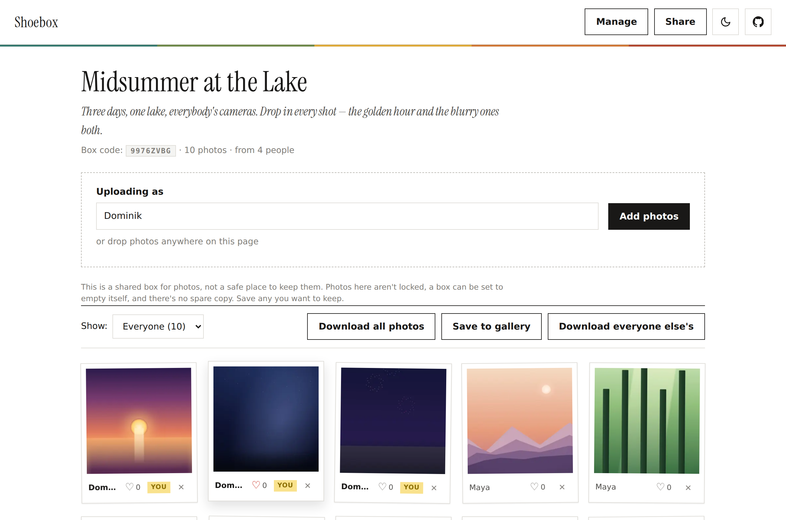
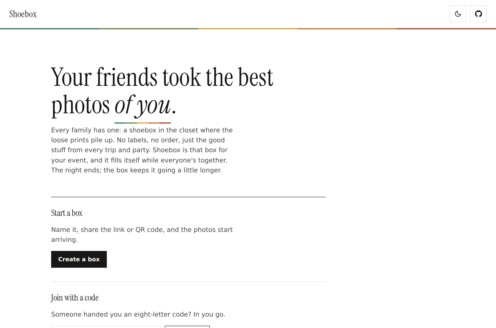
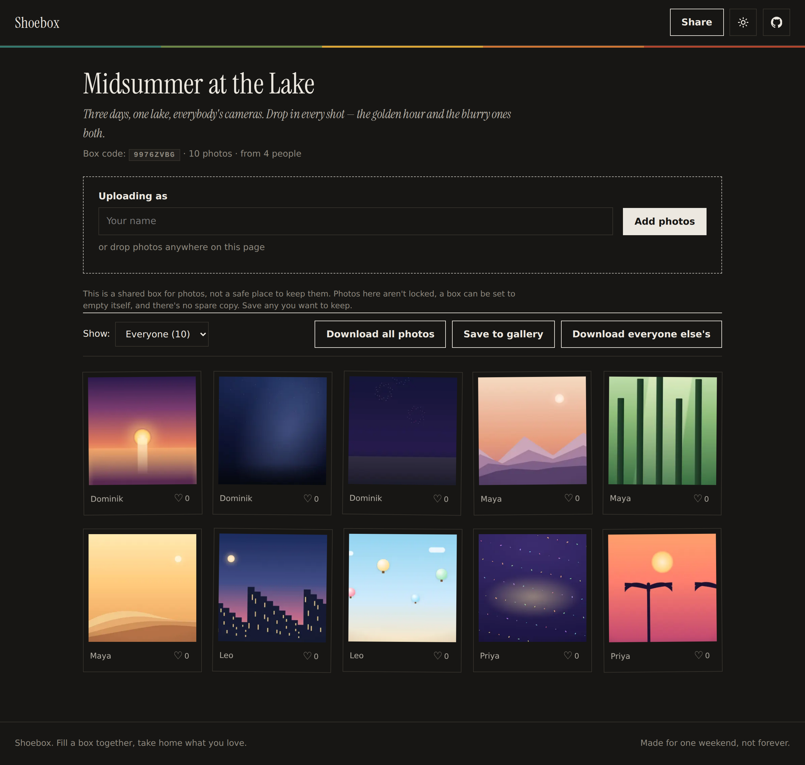
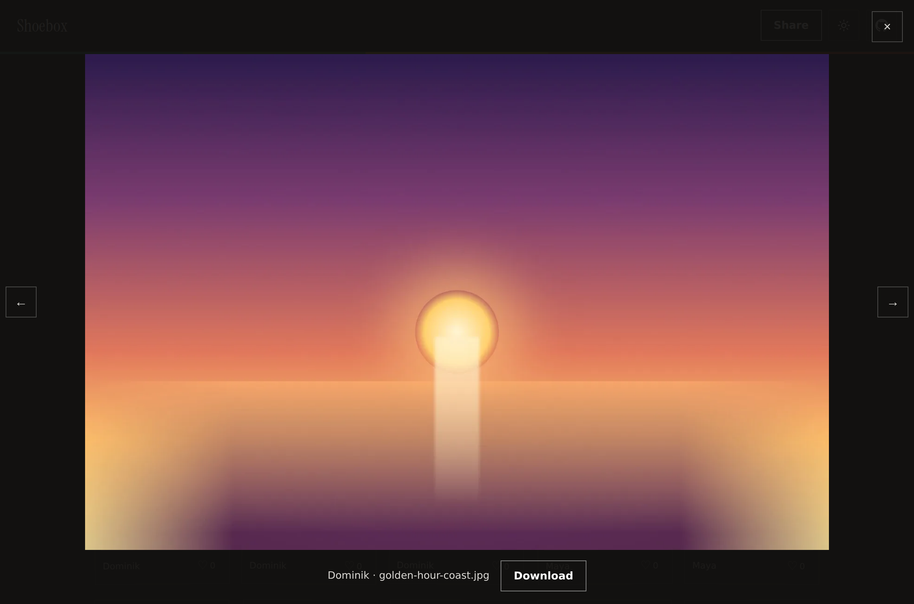
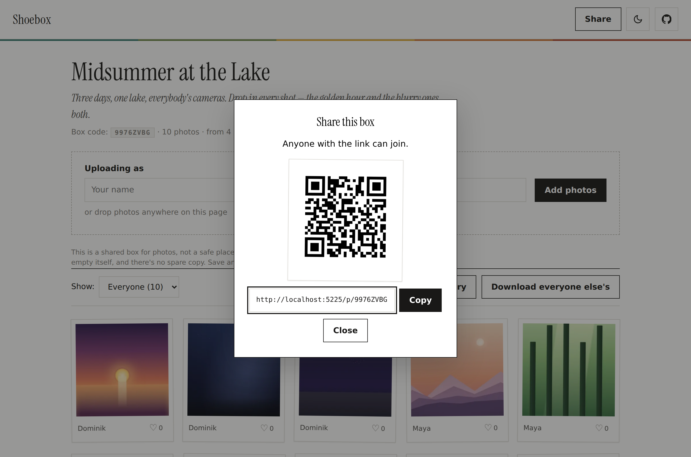
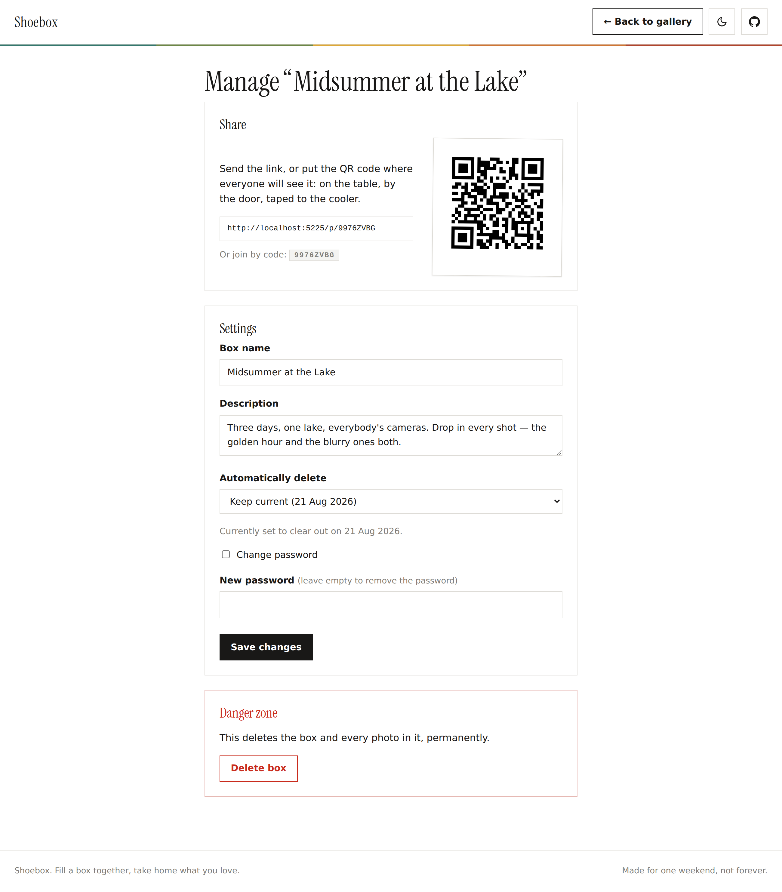
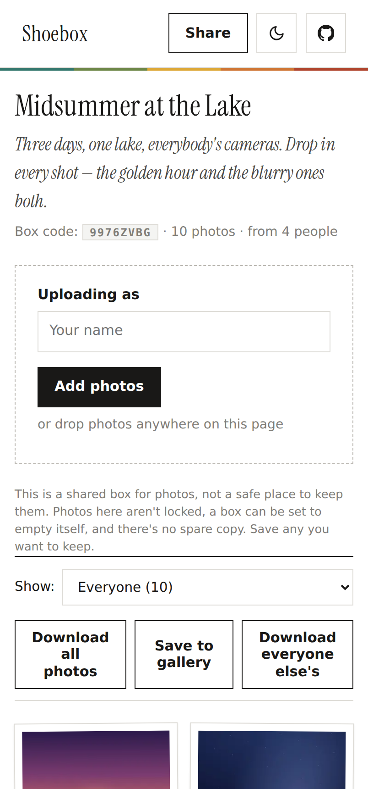

# Shoebox

A super lightweight, simple, self-hosted web app for collecting everyone's photos from a shared event into
one box. No accounts, no app. Share a link (or QR code), and people open it on their phone,
type their name, and upload. Useful for weddings, festivals, and trips, where the good photos
end up scattered across a dozen phones.

Every family has one: a shoebox in the closet where the loose prints pile up. This is that box,
for a group, and it fills itself.




<sup>A demo box, filled the way a real one fills itself: a few people, everyone's photos, no accounts. (Images above are placeholder gradients, not real photos.)</sup>

> [!IMPORTANT]
> Shoebox is built for casually sharing event photos, not for sensitive data, and not for
> durable storage.
>
> - **Files are stored unencrypted** on the server's filesystem. Anyone with access to the
>   host (or to its backups) can read every uploaded image. Only use a server you trust, and
>   don't upload anything you'd mind others seeing.
> - **It is not durable.** A single instance on a single filesystem, with no replication,
>   versioning, or off-site backup, and boxes can be set to delete themselves.
> - **It is for casual sharing, not confidential material.** Access rests on unguessable links
>   and an optional shared password. There are no accounts and no audit logging.
>
> Treat it as a convenient drop box: gather photos, then have people download what they want to
> keep. Back up the data directory yourself if a box matters.

## How it works

For the organizer:

1. Create a box, give it a name, and optionally set a password and an auto-delete date.
2. You get a share link and QR code to hand out, plus a private admin link to keep.

For everyone else:

1. Open the link (or scan the QR code). No sign-up.
2. Type your name and drag in photos.
3. Browse the gallery and grab everyone else's photos as a ZIP.

## Features

- **Shareable boxes**: one gallery per event, reachable by an 8-character code, a link, or a QR code. Boxes are unlisted: there is no directory and no way to browse other people's events.
- **No accounts**: uploaders just enter a name. A browser cookie remembers who they are, so their photos get a "you" badge and they can delete their own uploads.
- **Optional passwords**: a guest enters the password once per device; a signed cookie unlocks the box after that. Photo files live outside the web root and every image and download re-checks the cookie server-side, so a leaked image URL is useless without it.
- **Fast gallery**: a WebP thumbnail grid plus a full-screen lightbox backed by a downscaled web-safe proxy, so viewing is sharp without sending a full-size original over the wire. Filter by uploader; photos sort by capture time (EXIF).
- **HEIC / HEIF from phones**: decoded server-side, so iPhone photos get thumbnails and previews in every browser, not just Safari.
- **Flexible downloads**: a single photo, the whole box as a streamed ZIP, or "download others'": everything except your own uploads.
- **Private admin link**: the creator can rename the box, change or remove the password, adjust expiry, delete individual photos, or delete the whole box.
- **Auto-expiry**: a box can be set to delete itself a chosen number of days after the event.
- **Deduplication**: the same file uploaded twice is stored once (SHA-256).
- **Designed to be nice to use**: an editorial, print-inspired interface with a light/dark toggle, photos that "develop" in like film as the gallery loads, and layouts and tap targets that work on phones as well as desktops.
- **Simple storage**: files on disk plus a SQLite database. One directory holds everything.

## Screenshots

Share a link, and the box fills itself. The whole flow — from the landing page to a full
gallery, in light or dark — looks like this.

**The landing page.** No sign-up, no directory: start a box, or join one with a code.



**The gallery, in dark mode.** A WebP thumbnail grid that "develops" in like film as it loads.
Photos sort by capture time (EXIF); filter by uploader; like the ones you love.



**The lightbox and sharing.** Tap a thumbnail for a full-screen, web-safe proxy view with
download; hand out the box with a link or a QR code for the table.

| Full-screen lightbox | Share by link or QR |
|---|---|
|  |  |

**Managing a box, and on a phone.** The private admin link renames, re-passwords, sets
auto-expiry, or deletes the box; guests upload from their phone in a couple of taps.

| Admin panel | On a phone |
|---|---|
|  |  |

## Quick start

With Docker, which is the easiest way to run it:

```bash
docker compose up -d --build
# open http://localhost:8080
```

Or run a prebuilt image (published to GitHub Container Registry by CI):

```bash
docker run -d -p 8080:8080 -v shoebox-data:/data ghcr.io/domdom3333/shoebox:latest
```

All state (photos, database, cookie-signing keys) is kept in a volume mounted at `/data`.

### Run locally for development

Requires the [.NET 10 SDK](https://dotnet.microsoft.com/download).

```bash
dotnet run --project src/Shoebox.Web
# open the URL it prints (e.g. http://localhost:5225)
```

Data is written to `src/Shoebox.Web/data/` (gitignored).

## Configuration

Set via environment variables (`Shoebox__Key`) or the `Shoebox` section of
`appsettings.json`:

| Setting | Default | Purpose |
|---|---|---|
| `DataPath` | `/data` (Docker), `data` (local) | Root folder for the database, photos, and keys |
| `MaxFileSizeMb` | `50` | Per-file upload limit |
| `MaxImagePixels` | `100000000` | Reject images above this many pixels (bomb protection) |
| `MaxImageDimension` | `30000` | Reject images wider or taller than this many pixels |
| `UnlockAttemptsPerMinute` | `10` | Password-unlock attempts allowed per client IP per box per minute |
| `ThumbnailSize` | `480` | Longest edge of gallery thumbnails (px) |
| `DisplaySize` | `1600` | Longest edge of the lightbox proxy (px) |
| `DefaultExpiryDays` | `0` | Expiry pre-selected on the create form (`0` = never) |
| `CookieLifetimeDays` | `90` | How long unlock, identity, and admin cookies last |
| `PublicBaseUrl` | *(derived from request)* | Public URL used in share links and QR codes |

### Behind a reverse proxy

Shoebox honours `X-Forwarded-Proto` and `X-Forwarded-For`, so HTTPS termination in
Caddy, nginx, or Traefik works out of the box. It is designed to run behind a single trusted
proxy; do not expose the container directly, since the forwarded headers it trusts (used for
the client IP behind rate limiting and for the `Secure` cookie flag) would then be spoofable.
Two things to set:

- `Shoebox__PublicBaseUrl`: your public address, so QR codes and share links are correct.
- Your proxy's request-body limit: at least `MaxFileSizeMb` (for example `client_max_body_size 50m;` in nginx).

## Supported formats

Uploads are accepted and decoded server-side (Magick.NET) in these formats:

| Format | Extensions |
|---|---|
| JPEG | `.jpg`, `.jpeg` |
| PNG | `.png` |
| GIF | `.gif` |
| WebP | `.webp` |
| HEIC / HEIF | `.heic`, `.heif` |

Every accepted upload gets a WebP thumbnail and lightbox proxy regardless of source format, so
formats that browsers can't display natively (HEIC/HEIF from phones in particular) still
appear in the gallery everywhere. The original file is always stored unmodified and is what the
Download button returns. Files of the wrong type, over `MaxFileSizeMb`, or that don't decode as
a real image within the pixel limits are rejected at upload.

## Under the hood

### Three renditions per photo

Each upload is decoded once and produces three files, so every context gets a right-sized image:

| Rendition | Size | Format | Used for |
|---|---|---|---|
| Thumbnail | ~480px | WebP | Gallery grid |
| Display proxy | ~1600px | WebP | Full-screen lightbox |
| Original | untouched | as uploaded | Downloads and ZIPs |

### Storage layout

```
/data
├── shoebox.db                     # SQLite: boxes + photo metadata
├── keys/                             # Data Protection keys (signed cookies)
└── pools/{boxId}/
    ├── orig/{photoId}.{ext}          # untouched originals
    ├── thumb/{photoId}.webp          # grid thumbnails
    └── display/{photoId}.webp        # lightbox proxies
```

### Security model

Shoebox is intentionally lightweight, but the basics are done properly:

- **Passwords** are hashed with PBKDF2-SHA256 (100k iterations, per-hash salt, constant-time compare). Unlock is rate-limited per client IP per box.
- **Access is enforced on every byte.** Originals live outside `wwwroot`; the thumbnail, display, original, ZIP, and QR endpoints all re-check the signed access cookie, so requesting a URL without it returns 404 rather than the file.
- **Cookies** (access, admin, identity) are HttpOnly and SameSite=Lax; access and admin state is carried in tamper-proof, Data-Protection-signed cookies.
- **The admin link** carries a one-time capability key that is exchanged for a signed admin cookie and stripped from the URL on first use; POST handlers only accept the cookie, never the key.
- **Uploads** are limited by size and by pixel dimensions (decompression-bomb protection), restricted to a raster-image allowlist (no SVG or active content), and rejected if they don't decode. Stored filenames are random GUIDs, so there is no path traversal or overwrite.
- **Responses** set `X-Content-Type-Options: nosniff`, `X-Frame-Options: DENY`, `Content-Security-Policy: frame-ancestors 'none'`, and a lean `Referrer-Policy`.

The **uploader identity** cookie (which powers the "you" badge, delete-your-own, and "download
others'") is a convenience, not a security boundary. See the caveats at the top: this is not a
tool for confidential material.

### HTTP endpoints

| Route | Purpose |
|---|---|
| `GET /` | Home: join a box by code, or create one |
| `GET/POST /Create` | Create a box |
| `GET /p/{code}` | Gallery (redirects to unlock if locked) |
| `POST /p/{code}/unlock` | Verify password, set access cookie (rate-limited) |
| `GET /p/{code}/admin` | Admin panel (via key or admin cookie) |
| `POST /api/p/{code}/photos` | Multi-file upload |
| `GET /api/photos/{id}/thumb` · `/display` · `/original` | Serve a rendition (access-checked) |
| `DELETE /api/photos/{id}` | Delete a photo (own, or as admin) |
| `GET /api/p/{code}/zip?mode=all\|others` | Streamed ZIP download |
| `GET /api/p/{code}/qr` | QR code PNG for the box link |

## Project structure

```
src/Shoebox.Web/
├── Program.cs              # DI, middleware, EF init, upload limits, rate limiting
├── ShoeboxOptions.cs    # configuration
├── Data/                   # EF Core context + Pool / Photo entities
├── Services/               # boxes, photos, rendering, ZIP, access, cleanup…
├── Api/PhotoEndpoints.cs   # minimal-API upload/serve/zip/qr endpoints
├── Pages/                  # Razor Pages (home, create, gallery, unlock, admin)
└── wwwroot/                # css/js/fonts (no build step, no framework)
.github/workflows/docker.yml  # CI: build and publish the container image
Dockerfile · docker-compose.yml
```

## Continuous integration

`.github/workflows/docker.yml` builds the Docker image on every push and pull request, and
on pushes to the default branch (and version tags) publishes it to GitHub Container Registry as
`ghcr.io/domdom3333/shoebox`. Pull requests build only; they do not publish.

## Notes and limitations

- **Not for sensitive images.** Files are stored unencrypted on disk. Don't upload anything private to a host you don't fully control. See the note at the top.
- **Not long-term storage.** There is no redundancy or automatic backup; back up the data directory if a box matters, and don't rely on it as anyone's only copy.
- **The links are the credentials.** Anyone with the box link (and password, if set) can view and upload; anyone with the admin link can manage. There is no email or account recovery.
- **EXIF (including GPS) is preserved** on originals, and anyone in the box can download them. Worth mentioning to privacy-conscious guests.
- **Single instance, single filesystem.** This is deliberately simple software for an event, not a scalable photo platform. It expects one server, one data folder, and a trusted reverse proxy in front.

## Tech stack

ASP.NET Core Razor Pages (.NET 10), EF Core + SQLite, Magick.NET for all image rendering
including HEIC/HEIF (self-contained native, no system packages required), QRCoder, and a
vanilla JS/CSS front end, built as a multi-stage Docker image.

## License

[MIT](LICENSE)
